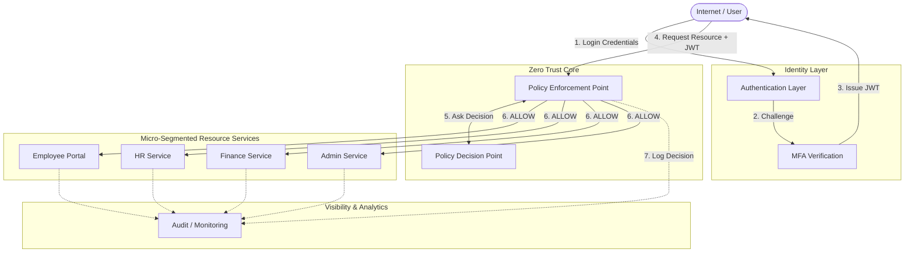
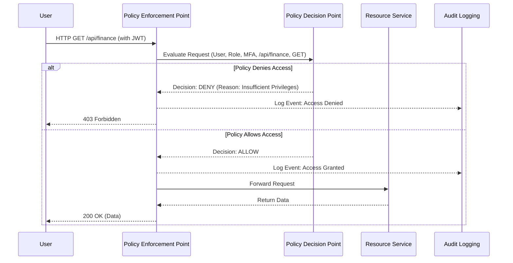
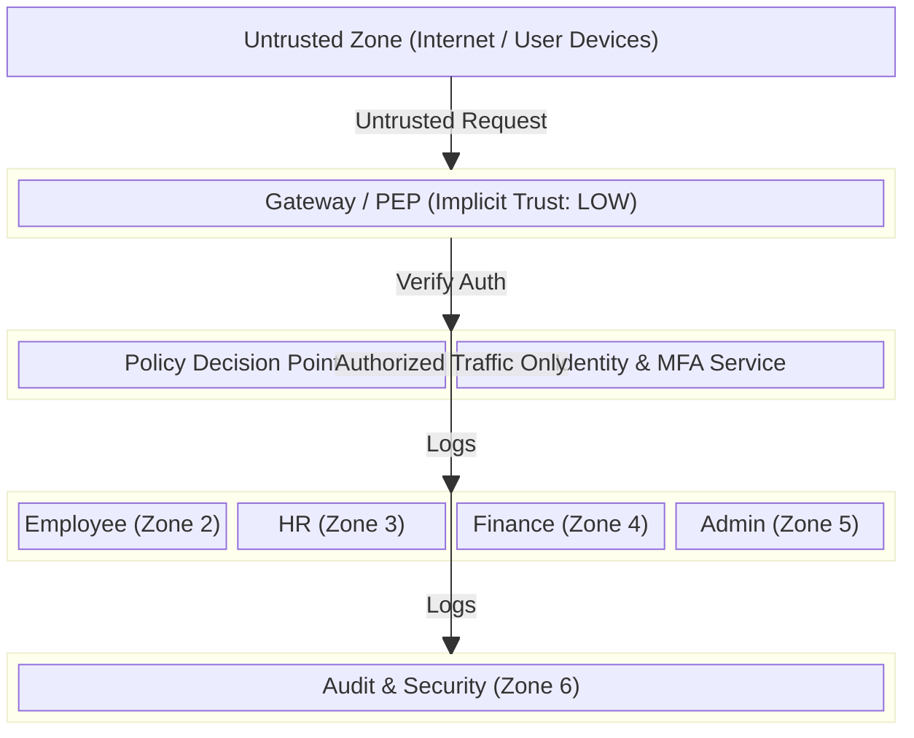

# Zero Trust System Architecture

## 1. Overview
This document outlines the architectural design for the "Zero Trust Architecture for Enterprise Security" project. It details the core components, fundamental Zero Trust concepts applied, and visualizes the system through architecture, data-flow, and trust-boundary diagrams.

## 2. Component Definitions

- **Identity Provider (IdP) / Authentication Service**: The authoritative source of user identities. It securely manages user credentials (hashed passwords) and handles the initial login process, issuing session tokens (JWT).
- **MFA Service**: An extension of the authentication layer that challenges users for a Time-based One-Time Password (TOTP) to prove possession of an enrolled device.
- **Authorization Service**: Maintains the Role-Based Access Control (RBAC) mappings (User -> Role -> Permissions).
- **Policy Engine**: The centralized brain of the Zero Trust model. It consists of the Policy Decision Point (PDP) and Policy Enforcement Point (PEP) to evaluate every request against established rules.
- **Resource Servers**: The simulated business logic services that users interact with:
  - **Employee Portal**: General employee resources.
  - **HR Service**: Human Resources management.
  - **Finance Service**: Financial data management.
  - **Admin Service**: System administration endpoints.
- **Audit Logging**: A centralized service that securely receives, stores, and indexes logs of all access attempts, policy decisions, and administrative actions.
- **Security Monitoring**: A dashboard (utilized by the Security Analyst role) to visualize audit logs, detect anomalies, and monitor failed access attempts.
- **Network/Service Segmentation**: Logical isolation (implemented via Docker networks) ensuring that Resource Servers cannot communicate with one another laterally unless explicitly permitted by policy.

## 3. Core Zero Trust Concepts Explained

- **Policy Decision Point (PDP)**: The engine that calculates whether a specific request should be allowed or denied. It takes inputs such as user identity, role, MFA status, requested resource, and action, then evaluates them against the defined security policy.
- **Policy Enforcement Point (PEP)**: The gateway or middleware that intercepts the user's request. It pauses the request, asks the PDP for a decision, and then either forwards the request to the Resource Server (if ALLOW) or blocks it and returns an error (if DENY).
- **Identity Verification**: The process of cryptographically ensuring the user is who they claim to be, utilizing strong passwords and TOTP MFA, resulting in a verifiable JWT.
- **Least Privilege**: Users are granted only the minimum access required to perform their job functions. For example, an Employee cannot access HR data; an HR Manager cannot access Finance data.
- **Continuous Verification**: A valid JWT token is not enough. The Policy Engine re-evaluates the user's role and permissions on *every single request* to ensure their access hasn't been revoked mid-session.
- **Assume-Breach Model**: The architecture is designed under the assumption that an attacker may already be inside the network. Consequently, internal services do not inherently trust requests originating from other internal services without explicit authorization through the Policy Engine.

---

## 4. Diagrams

### 4.1 Architecture Diagram
This diagram shows the high-level components and the flow of a request from the Internet to the Resource Services.

### 4.2 Data-Flow Diagram
This diagram illustrates how data and decisions flow through the system during a resource request.

### 4.3 Trust-Boundary Diagram
This diagram highlights the trust boundaries. Notice that no component implicitly trusts another across boundaries.

