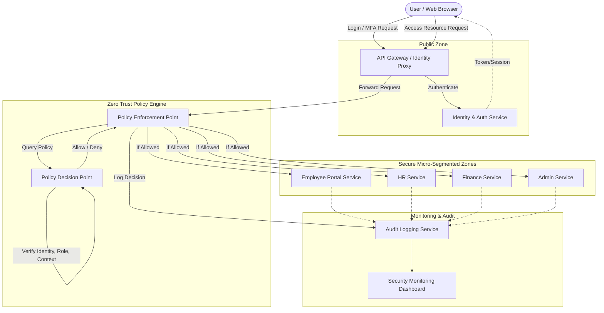

# Project Plan: Zero Trust Architecture for Enterprise Security

## High-Level Architecture Diagram


## Proposed Architecture Mapping to Requirements
- **Understand Zero Trust principles**: Implemented via the central Policy Decision Point (PDP) which re-evaluates access for *every* request (Never trust, always verify).
- **Implement authentication models**: Handled by the Identity & Auth Service using JWT, password hashing, and TOTP MFA.
- **Design a Zero Trust framework**: Handled by the separation of the Policy Engine from individual services, alongside audit logging.
- **Simulate an enterprise security environment**: Handled by deploying each service in isolated Docker containers with segmented Docker networks.
- **Test security architecture**: Covered in automated unit/integration tests and manual demonstration scenarios.

## Development Phases
- **Phase 0**: Requirements and Project Planning *(Current)*
- **Phase 1**: System Architecture
- **Phase 2**: Project Scaffolding
- **Phase 3**: Identity and Authentication
- **Phase 4**: Multi-Factor Authentication (MFA)
- **Phase 5**: Role-Based Access Control (RBAC)
- **Phase 6**: Zero Trust Policy Engine
- **Phase 7**: Micro-segmentation
- **Phase 8**: Encryption and Secure Communication
- **Phase 9**: Audit Logging and Security Monitoring
- **Phase 10**: Enterprise Dashboard
- **Phase 11**: Safe Threat Simulation
- **Phase 12**: Automated Testing
- **Phase 13**: Security Review
- **Phase 14**: Final Documentation
- **Phase 15**: Final Demonstration Mode
- **Phase 16**: Viva Preparation

## Technologies & Stack
- **Frontend**: React + Vite (Simplicity, Modern tooling)
- **Backend**: Python FastAPI (Ideal for microservices and building clear REST APIs quickly)
- **Database**: SQLite (Perfect for local simulated environments without external dependencies)
- **Authentication**: JWT, bcrypt/Argon2id for passwords, `pyotp` for TOTP MFA.
- **Containerization**: Docker, Docker Compose (for micro-segmentation and local deployment)

## Folder Structure (Planned)
```text
zero-trust-enterprise/
├── frontend/             # React application
├── backend/
│   ├── auth/             # Identity & Auth Service
│   ├── policy/           # Zero Trust Policy Engine
│   ├── services/         # HR, Finance, Admin, Employee simulated services
│   └── audit/            # Audit Logger Service
├── database/             # SQLite DB files and initialization scripts
├── security/             # Keys, certificates (development only)
├── tests/                # Automated tests (Pytest)
├── docker/               # Dockerfiles and configuration
├── docs/                 # All project documentation
├── docker-compose.yml    # Main deployment file
└── README.md
```
